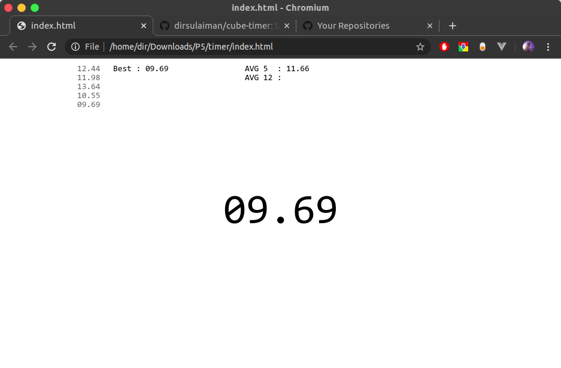

# SpeedCube Timer
Simple Rubik stopwatch timer web based

## Installation
#### Clone from [GitHub](https://github.com/dirsulaiman/cube-timer)
```console
$ cd to/your/directory
$ git clone https://github.com/dirsulaiman/cube-timer.git
```
#### Download ZIP
Or in an easier way, just download [cube-timer-master.zip](https://github.com/dirsulaiman/cube-timer) and extract it

## Usage
- Open _index.html_ with your browser (internet connection is not required)
- Press and hold __Space bar__ until the font color change to Green
- Release the __Space bar__ to start the timer
- Press __Space bar__ again to stop the timer

### Preview


### License
Source file: [BSD License](https://github.com/dirsulaiman/cube-timer/blob/master/LICENSE)
